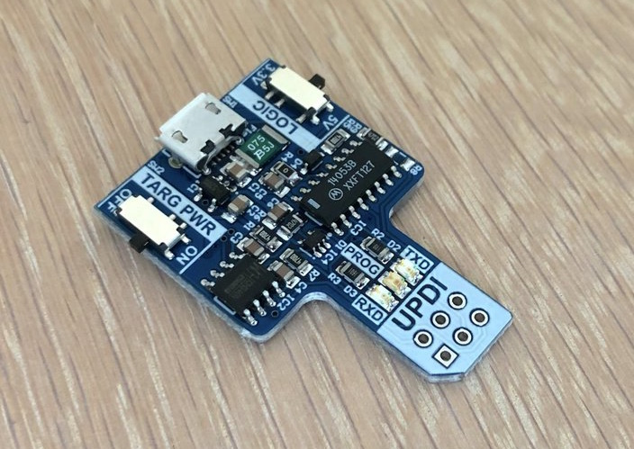
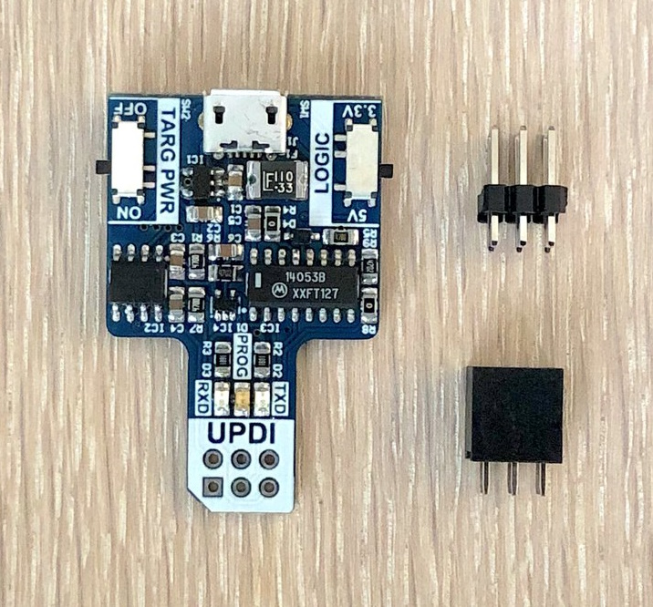
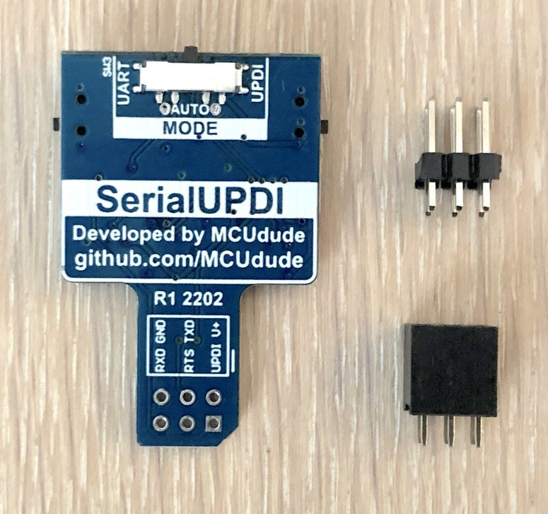
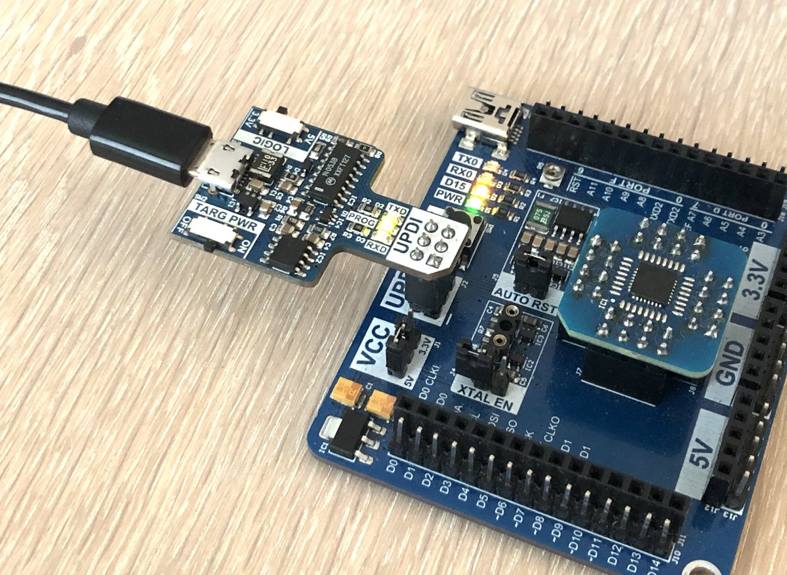
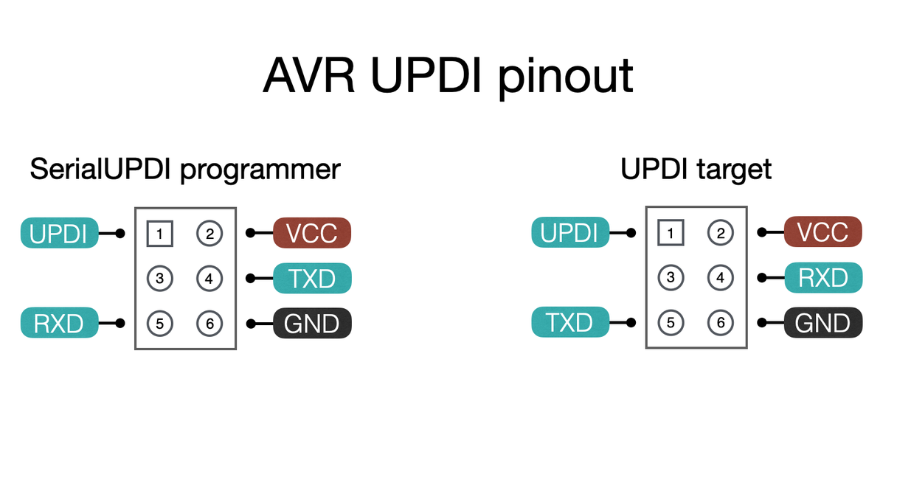
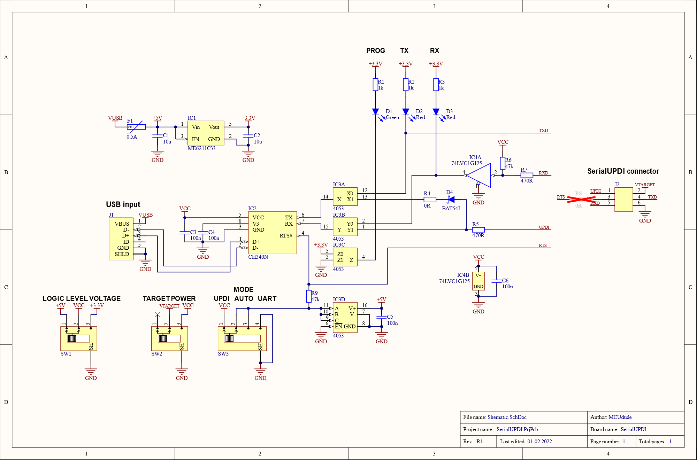

# SerialUPDI-programmer
A convenient UPDI programmer with automatic UART / UPDI selection Designed by [MCUdude](https://github.com/MCUdude) (Hans) in Norway  
(you can buy it here: https://www.tindie.com/products/mcudude/serialupdi-programmer)  

  
There are also other approaches to realising a SerialUPDI adapter, like e.g.:   
<ul><li><a href="https://github.com/BlackBrix/AVR-Programmer/tree/master/SerialUPDI_Programmer">SerialUPDI-Programmer</a></li>  
<li><a href="https://github.com/BlackBrix/AVR-Programmer/tree/master/SerialUPDI_HV_Programmer">SerialUPDI-HV-Programmer</a></li>
<li><a href="https://github.com/BlackBrix/tinyUPDI">tinyUPDI</a></li>
<li><a href="https://github.com/BlackBrix/UPDI-USB-SERIAL">UPDI-USB-SERIAL</a></li>
<li><a href="https://www.adafruit.com/product/5879">Adafruit's new SerialUPDI LV adapter "UPDI Friend"</a> (with USB-C / CH340E / AP2112K)</li>
<li><a href="https://www.facebook.com/adafruitindustries/posts/pfbid0yZC4EiRVcFa7jaTvnwEeRmVsJKAEUtLLCXMT1xMuVpeAXi5uwuVmAa3XUmftpULKl">Adafruit plans for a SerialUPDI HV adapter</a>
</ul>
what the SerialUPDI approach is all about, and why it is the successor to jtag2UPDI: 
<ul><li><a href="https://github.com/SpenceKonde/AVR-Guidance/blob/master/UPDI/jtag2updi.md">SerialUPDI</a></li>
<li><a href="https://teddywarner.org/Projects/SerialUPDI/#serial-programming">Serial programming</a></li>
<li><a href="https://teddywarner.org/Projects/SerialUPDI/#programmer-usage">Programmer Usage (with the arduino IDE)</a></li>
</ul>

  

<h3>What is it?</h3>

The MCUdude SerialUPDI programmer is a tiny programmer for use with <em>any</em> AVR that has a UPDI programming interface. It can also be used as a standard USB to serial adapter for easy serial debugging.

<h3>Why did you make it?</h3>

I made this board because there doesn't exist a SerialUPDI-based programmer that can automatically switch between UART and UPDI mode. It's also very convenient that the board can supply either 3.3V or 5V to the target. Unlike the <a href="https://github.com/MCUdude/microUPDI">microUPDI programmer</a>, this programmer supports the AVR-DA, AVR-DB, and AVR-DD series as well. It's also significantly faster than the microUPDI.

<h3>What makes it special?</h3>
<ul>
<li>Versatile programmer that supports all AVRs that can be programmed using UPDI</li>
<li>Switch between 3.3V and 5V logic, and use a dedicated switch to power the target</li>
<li>Supported by <a href="https://github.com/avrdudes/avrdude">Avrdude</a> and <a href="https://github.com/microchip-pic-avr-tools/pymcuprog">Pymcuprog</a> for command line programming</li>
<li>Can be used though Arduino IDE through <a href="https://github.com/MCUdude/MegaCoreX">MegaCoreX</a>, <a href="https://github.com/SpenceKonde/DxCore">DxCore</a> and <a href="https://github.com/SpenceKonde/megaTinyCore">megaTinyCore</a></li>
<li>Supports UPDI and UART mode</li>
<li>The tiny, three-way switch on the back of the board lets you select three different modes. <ul>
<li>UPDI - Programmer is always in UPDI programming mode (PROG LED on)</li>
<li>UART - Programmer is always in UART mode and will send and receive data on the RX and TX pins to the target (PROG LED off)</li>
<li>AUTO - Programmer will automatically switch between UPDI and UART mode. RTS active (LOW level) -> UPDI mode, RTS inactive (HIGH level) -> UART mode.</li>
</ul>
</li>
</ul>
<h3>AUTO mode</h3>

When the programmer is set to AUTO, it is the RTS handshake line that determines the mode. This means that the upload tool has to set this to <em>active</em> (low level) in order for the programmer to switch over to UPDI mode. On the other side, the serial monitor program has to set the RTS line to <em>inactive</em> (high level) in order for the programmer to switch over to UART mode. Avrdude and Pymcuprog set the RTS line active when programming, but serial monitors aren't that consistent. If the upload tool or serial monitor doesn't do anything with the RTS line, the RTS line would do whatever the default behavior is, depending on the OS driver.

<table>
<thead>
<tr>
<th>SerialUPDI AUTO mode</th>
<th>Windows</th>
<th>MacOS</th>
<th>Linux</th>
</tr>
</thead>
<tbody>
<tr>
<td>Uploading</td>
<td>Works</td>
<td>Works</td>
<td>Works</td>
</tr>
<tr>
<td>Arduino serial monitor</td>
<td>Works</td>
<td>Works some times</td>
<td>Not yet tested</td>
</tr>
<tr>
<td>Platformio serial monitor</td>
<td>Works</td>
<td>Works</td>
<td>Works</td>
</tr>
</tbody>
</table>

When using the SerialUPDI programmer with the PlatformIO serial monitor, please add the following snippet to your platformio.ini file. (I have no idea why their serial monitor, Miniterm, believes the RTS pin actually is DTR, but it works!)

<code>monitor_dtr = 0</code>

<h3>Differences between <a href="https://github.com/MCUdude/microUPDI">microUPDI</a> and SerialUPDI</h3>
<table>
<thead>
<tr>
<th></th>
<th>SerialUPDI</th>
<th>microUPDI</th>
</tr>
</thead>
<tbody>
<tr>
<td>Supported targets</td>
<td>All AVRs with UPDI</td>
<td>ATtiny and ATmega's with UPDI</td>
</tr>
<tr>
<td>Fully assembled</td>
<td>Yes *</td>
<td>No (Pro Micro not included)</td>
</tr>
<tr>
<td>Debug support</td>
<td>No</td>
<td>Yes</td>
</tr>
<tr>
<td>Programming speed</td>
<td>Fast</td>
<td>Moderate</td>
</tr>
<tr>
<td>Microchip Studio / MPLAB X support</td>
<td>No</td>
<td>Yes</td>
</tr>
<tr>
<td>USB to serial/UART</td>
<td>Yes (native)</td>
<td>Yes (emulated, limited baud rate)</td>
</tr>
<tr>
<td>Target power</td>
<td>5V / 3.3V / none</td>
<td>5V / 3.3V / none</td>
</tr>
</tbody>
</table>

* 6-pin programming connector not soldered

<h3>SerialUPDI and Avrdude</h3>

The SerialUPDI programmer is designed to be used with Avrdude 7 or newer, but can also be used with <a href="https://github.com/microchip-pic-avr-tools/pymcuprog">Pymcuprog</a>.

A compatible version of Avrdude is automatically installed when you install MegaCoreX, but you can also <a href="https://github.com/avrdudes/avrdude">compile your own</a>. Pre-built, static binaries for your favorite system can be downloaded from the <a href="https://github.com/arduino/avrdude-packing/releases">Arduino Avrdude-packaging repo</a>. For more information om how to use Avrdude, see the <a href="https://avrdudes.github.io/avrdude/">official documentation</a>.

<h4>Usage</h4>

In order for the programmer to behave consistently in AUTO mode, the <code>-x rtsdtr=high</code> flag needs to be present.

Write to flash and EEPROM:

<code>avrdude.exe -C /path/to/avrdude.conf -c serialUPDI -P COMx -x rtsdtr=high -U flash:w:my_program.hex:i -U eeprom:w:my_program.eep:i</code>

Read flash and EEPROM, and write the content to flash_content.hex and eeprom.hex:

<code>avrdude.exe -C /path/to/avrdude.conf -c serialUPDI -P COMx -x rtsdtr=high -U flash:r:flash_content.hex:i -U eeprom:r:ee_content.hex:i</code>

Write SYSCFG0 fuse:

<code>avrdude.exe -C /path/to/avrdude.conf -c serialUPDI -P COMx -x rtsdtr=high -U syscfg0:w:0xC9:m</code>

Note that there are a few optional flags you can add:

<ul>
<li>Note that the <code>-C path/to/avrdude.conf</code> flag is not needed if the avrdude.conf and avrdude executable are located in the same folder </li>
<li><code>-b [baudrate]</code> sets the upload speed. Defaults to 115200 if not specified</li>
<li><code>-v</code>, <code>-vv</code>, <code>-vvv</code> or <code>-vvvv</code> sets the verbosity level to 1, 2, 3 or 4</li>
<li><code>-qq</code> mutes all output.</li>
<li><code>-t</code> enters terminal mode, where all memories can be read and written to at a byte level</li>
</ul>

